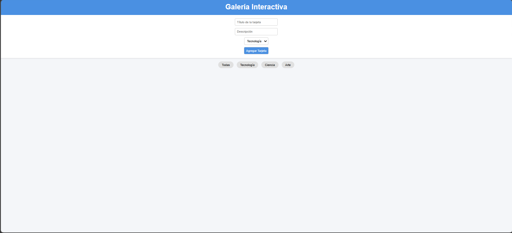
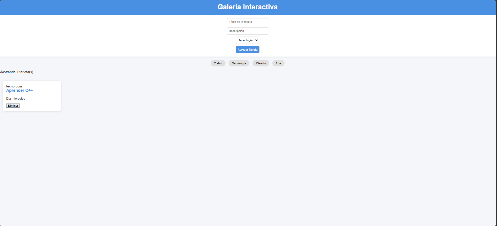
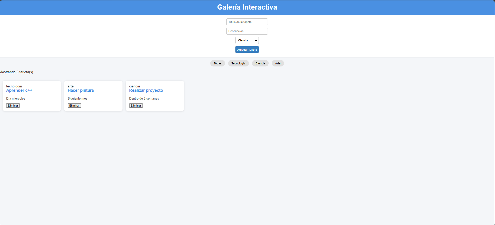
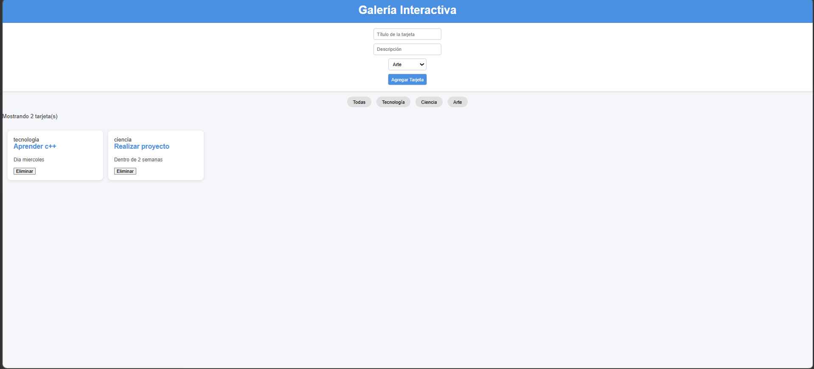

# Galería Interactiva - Unidad 4 (JavaScript Básico)

## Descripción del Proyecto
Este proyecto corresponde al **Post-Contenido 1 de la Unidad 4: JavaScript Básico** del curso de **Ingeniería de Sistemas en la Universidad de Santander (UDES)**.  
El objetivo es construir una **galería interactiva de tarjetas** utilizando **JavaScript puro**, aplicando:

- Métodos de selección y manipulación del DOM (`createElement`, `appendChild`, `remove`, `classList`).
- Modelo de eventos (`addEventListener`, `event.target`, delegación de eventos).
- Características de ES6 (arrow functions, template literals, desestructuración).

La aplicación permite **crear, filtrar y eliminar tarjetas dinámicamente** en respuesta a las interacciones del usuario.

---

## Tecnologías Utilizadas
- **HTML5**   
- **CSS3**
- **JavaScript ES6**   
- **Visual Studio Code + Live Server**
- **Google Chrome (DevTools)**
- **Git & GitHub** 

---

## Instrucciones de Ejecución
1. Clonar el repositorio:
   git clone https://github.com/SergioMoreno09dev/Moreno-post1-u4.git

## Capturas

1. Vista inicial

2. Creación de tarjetas

3. Eliminación de tarjetas

4. Vista con contador y filtro
